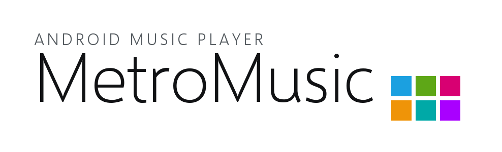
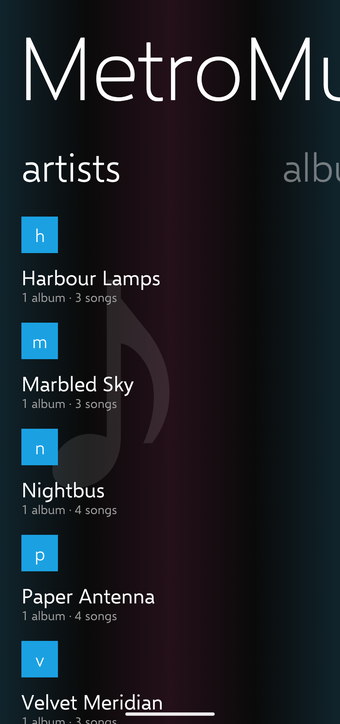
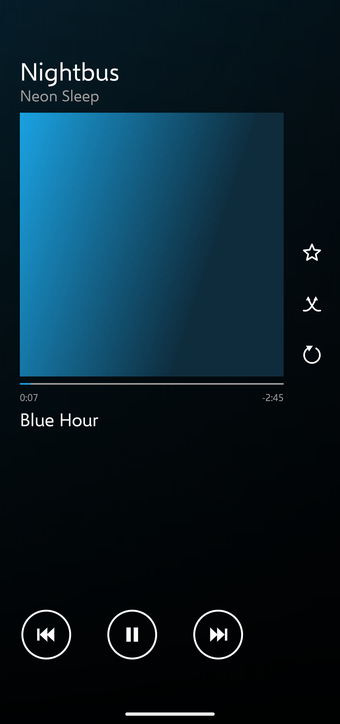
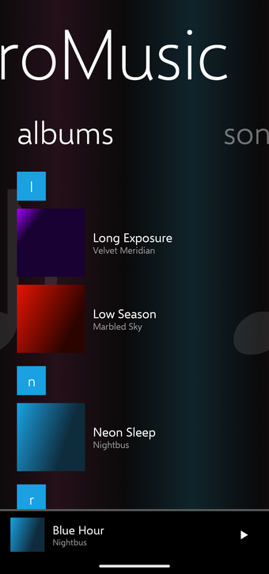

<h1>
  <picture>
    <source media="(prefers-color-scheme: dark)" srcset="docs/banner-dark.png">
    
  </picture>
</h1>

A music player for Android that looks and moves like Windows Phone 8's Music + Videos hub.

It plays what is already on the phone. No account, no feed, no recommendations — the library on your
device, arranged the way that hub arranged it, and everything that touches the network is optional and
switchable off.

`minSdk 26` · `compileSdk 36` · Kotlin and Compose · GPLv3

| start | now playing | panorama ∞ |
|:---:|:---:|:---:|
|  |  |  |

## What it does

**The collection is the start screen.** The panorama you land on *is* the library — artists, albums,
songs, genres, playlists, history and settings, in whatever order you put them. It is circular, so
settings sit one swipe to the *left* of where you start and nothing is more than a swipe away.

**Getting around a big library.** Long lists group alphabetically and open the WP8 jump grid over both
Latin and Cyrillic. Tapping a section header searches inside that section. A long press on any album,
artist or genre plays it, queues it after what you already queued, or hides it — and hiding takes
effect in every list at once. Album metadata is edited into the tags inside the files, which is the
only level where a change sticks. Playlists, favourites, play counts and history are yours and local.

**Playing.** Media3 in a media session: notification, lock screen, headset and Bluetooth, and playback
that outlives the screen. The queue and the current track come back after the app is closed. Apple
Lossless is decoded in the app, because Android ships no ALAC decoder and silently plays such files as
silence. Equalizer over the device's own bands, sleep timer, and a WP8 volume banner in place of the
system panel.

**Last.fm.** Scrobbling is local-first: a play is written to disk with the second it started and sent
when a *validated* network appears, so an hour underground turns up in the right order rather than as
a burst on reconnection. Favourites can be kept the same as your loved tracks, in both directions, as
a merge against what the two sides last agreed on. Albums whose files have no cover are asked about
once. Lyrics come from Genius with no API token.

`CHANGELOG.md` is the full list; the reasoning behind the awkward parts is in the comments beside them.

## Built on MangoTile

The whole interface is [MangoTile](https://github.com/Diffechento/MangoTile), a Compose UI kit for
building apps in the WP8 idiom — the panorama and its parallax, the long list and its jump grid, the
tiles, the flat typography, the transitions. MetroMusic is its first real application, and every gap
this app hit became a feature over there rather than a workaround here.

## Building

The framework comes from Maven Central, so a clone builds as it stands:

```
./gradlew :app:assembleDebug
```

**Last.fm credentials are optional.** Copy `local.properties.example` to `local.properties` and fill
in `LASTFM_API_KEY` / `LASTFM_API_SECRET` if you want scrobbling and cover lookup; without them the app
builds and runs and asks for a key on its own Last.fm page. Get a pair at
<https://www.last.fm/api/account/create>. Nothing else needs a key.

**Release builds** are signed with the debug key unless a `keystore.properties` sits in the project
root (`storeFile`, `storePassword`, `keyAlias`, `keyPassword`) — installable for sideloading either
way, but publishing needs a keystore of your own. R8 is on. GitHub Actions builds the release APK and
AAB on every push, and attaches them to a release when a `v*` tag is signed.

## Licence

Copyright (C) 2026 Diffechento.

**GNU General Public License, version 3** — see [LICENSE](LICENSE). Fork it, sell it, put it in a
store; ship it to anyone and they get the source and these same freedoms. It has to be v3 rather than
v2: almost the whole stack under this app is Apache-2.0, which is incompatible with GPLv2 and
compatible with GPLv3.

MangoTile itself is MIT; the copyleft here is a decision about this application only. Third-party
notices are in [THIRD-PARTY-NOTICES.md](THIRD-PARTY-NOTICES.md) and in the app, on settings → about.

Not affiliated with Microsoft, Last.fm or Genius. "Windows Phone" and "Metro" are Microsoft's; this is
an homage to a design language, written from scratch.
